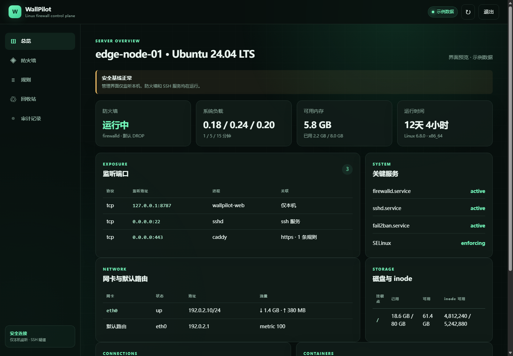

# WallPilot

[](https://github.com/Zzsv/wallpilot/actions/workflows/tests.yml)
[](https://www.python.org/)
[](LICENSE)

[简体中文](README.md) · [English](README.en.md)

WallPilot is a safety-first web control plane for Linux host firewalls and
server status. It turns common firewalld and UFW operations into guided
workflows while putting rollback, recoverable deletion, and privilege
separation ahead of convenience.

> WallPilot is currently at `0.1.0`. Validate it on a disposable host, or on a
> server with out-of-band console access, before using it in production.
> WallPilot manages only the host firewall. It does not change cloud security
> groups, routers, or load balancers.



> This is the real WallPilot interface. The hostname, addresses, and metrics
> are explicitly marked sample data so no server information is disclosed.

## Highlights

- Detects Ubuntu, Debian, RHEL, Rocky Linux, AlmaLinux, Fedora, openSUSE,
  Arch Linux, their versions, and `ID_LIKE` families.
- Selects the actually active firewalld, UFW, nftables, or iptables backend.
  Multiple active backends force read-only conflict mode.
- Provides full rule management for firewalld and UFW. Native nftables and
  legacy iptables are read-only in the first release.
- Supports ports, services, networks, interfaces, routing, IPv4/IPv6,
  masquerading, forwarding, rich rules, zones, policies, and IP sets where
  the selected backend supports them.
- Applies risky changes as a 90-second trial. Unconfirmed changes roll back
  automatically.
- Moves deleted rules and advanced objects into an integrity-checked recycle
  bin before permanent removal.
- Shows host identity, load, memory, storage, network interfaces, routes, DNS,
  listeners, active connections, SSH sessions, containers, security services,
  and firewall rejection logs.
- Includes `wallpilot doctor`, a read-only diagnostic command for installation,
  permissions, backend conflicts, service health, and SSH tunnel readiness.

## Security defaults

- The web service listens on `127.0.0.1:8787` by default and does not open a
  firewall port during installation.
- The management URL includes a locally generated 256-bit random path.
- A password and TOTP are still mandatory; the random path is not treated as
  authentication.
- The web process runs as the unprivileged `wallpilot` user.
- A separate root agent listens only on a Unix socket and accepts a small,
  typed allowlist of firewall operations.
- Agent messages use HMAC authentication. Service actions accept only detected
  firewall units.
- Passwords use Argon2id. Sessions use hashed tokens, CSRF protection,
  Host/Origin validation, HttpOnly/SameSite cookies, CSP, and rate limiting.
- User input is never converted into shell commands.
- No CDN, external font, analytics script, or telemetry endpoint is loaded.

See the complete [threat model](docs/threat-model.md).

## Requirements

- Linux with systemd
- Python 3.10 or newer
- firewalld or UFW for writable management
- nftables or iptables for read-only inspection
- root access for installation and the restricted agent

## One-command installation

Run this on the Linux server:

```bash
curl -fsSL --proto '=https' --tlsv1.2 https://raw.githubusercontent.com/Zzsv/wallpilot/main/install-online.sh | sudo sh
```

To inspect the installer before running it:

```bash
curl -fsSLo wallpilot-install.sh https://raw.githubusercontent.com/Zzsv/wallpilot/main/install-online.sh
less wallpilot-install.sh
sudo sh wallpilot-install.sh
```

Manual installation:

```bash
git clone https://github.com/Zzsv/wallpilot.git
cd wallpilot
sudo ./install.sh
```

The installer prints a one-time bootstrap token, a TOTP secret, and the random
management URL. Save the recovery codes offline when setup is complete.

## Connect through SSH

From your workstation:

```bash
ssh -L 8787:127.0.0.1:8787 user@server
```

Then open the random management URL printed by the installer. The public
internet is not the default access path.

## Diagnose an installation

```bash
sudo WALLPILOT_STATE_DIR=/var/lib/wallpilot \
  /opt/wallpilot/venv/bin/wallpilot doctor
```

Add `--json` for automation. Diagnostic output never includes the random
management path, the agent key, passwords, TOTP secrets, or recovery codes.

## Anti-lockout workflow

1. Create a change draft.
2. Review the before/after diff, affected sources and ports, and lockout risk.
3. Enter the six-digit confirmation code generated by the page.
4. High-risk actions additionally require TOTP and the hostname.
5. WallPilot saves a snapshot and applies the trial change.
6. Confirm connectivity within 90 seconds, or the watchdog rolls it back.

Emergency console commands:

```bash
sudo WALLPILOT_STATE_DIR=/var/lib/wallpilot \
  /opt/wallpilot/venv/bin/wallpilot emergency-start

sudo WALLPILOT_STATE_DIR=/var/lib/wallpilot \
  /opt/wallpilot/venv/bin/wallpilot emergency-rollback
```

## Recycle bin

- A deletion enters the recycle bin only after its trial is confirmed.
- Snapshots include the backend, system version, stable fingerprint, complete
  configuration, dependencies, previous state, actor, source, and reason.
- Database records and JSON snapshots carry integrity checks.
- Restore operations use the same preview and rollback workflow.
- Name conflicts and missing dependencies block unsafe restores.
- Permanent purge requires the administrator password, TOTP, and explicit
  confirmation text. Audit records are retained.

## Local commands

```text
wallpilot bootstrap
wallpilot status [--json]
wallpilot doctor [--json]
wallpilot serve
wallpilot rotate-path
wallpilot emergency-start
wallpilot emergency-rollback
```

## Development

```bash
python3 -m venv .venv
. .venv/bin/activate
python -m pip install -e '.[test]'
pytest
```

Firewall operations in tests use injected adapters and fixed command
responses. The development test suite does not modify the host firewall.

Read [CONTRIBUTING.md](CONTRIBUTING.md) before opening a pull request. Report
security issues according to [SECURITY.md](SECURITY.md), not in a public issue.

## Scope

- Only firewall services can be controlled. Other systemd services are
  read-only.
- firewalld and UFW are writable; nftables and iptables are read-only in the
  first release.
- Service control requires systemd.
- Public HTTPS exposure is opt-in and requires a trusted reverse proxy.
- WallPilot does not modify cloud firewalls or automatically update the OS.
- Server data stays on the host.

## License

[MIT](LICENSE)
